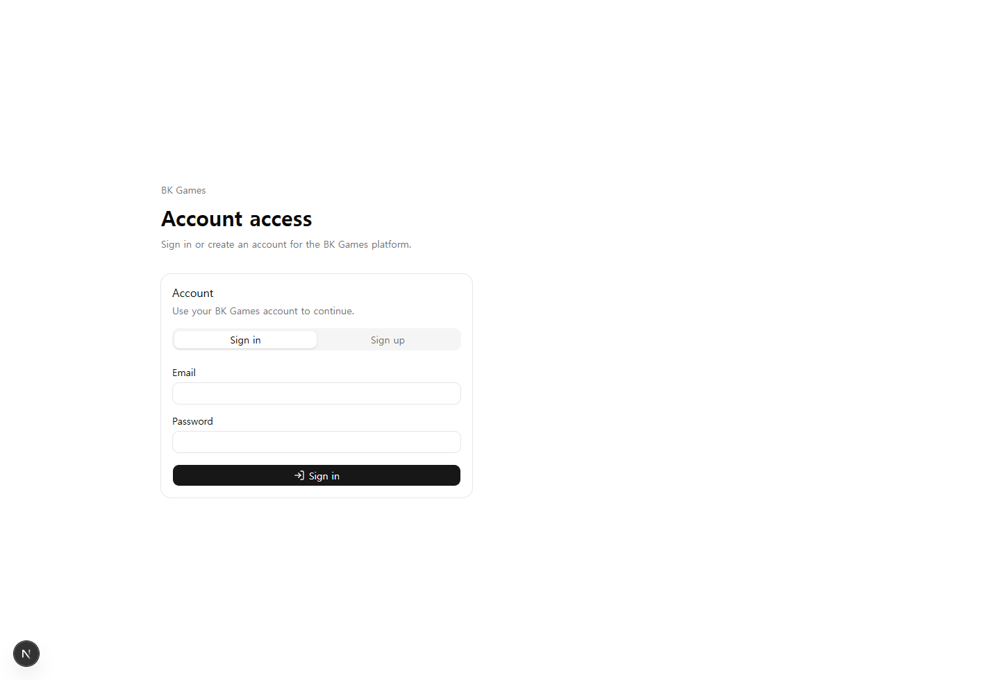
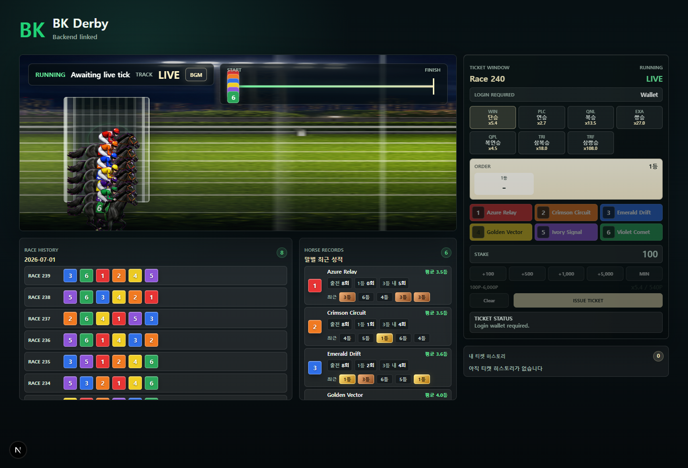
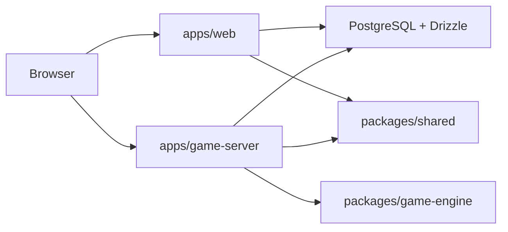

# BK Games

BK Games is a free-points multiplayer game platform built around real-time games, a shared wallet, and server-authoritative settlement.

The project started with Blackjack, but it is not a Blackjack-only app. The platform is structured so new games can reuse the same account, wallet, lobby, point ledger, and real-time infrastructure.

> Draft status: this README is a working project overview. Screenshots are local development snapshots and can be replaced before publishing.

## What This Project Is

BK Games is a portfolio-scale full-stack game platform focused on real-time systems and point-wallet correctness.

- Free points only
- No cash deposits or withdrawals
- No point exchange, point transfer, or marketplace
- Authenticated accounts with Better Auth
- Shared wallet and ledger-backed point movement
- Server-authoritative game state and settlement
- Socket.IO table updates for real-time game screens

The core loop is simple: browse the public home page, sign in when you are ready to claim free points or place a bet, pick a game, play with the shared wallet, and receive private wallet updates after accepted actions or settlement.

## Screenshots

| Account Access |
|---|
|  |

| BK Derby |
|---|
|  |

Home, Blackjack, and Baccarat table screenshots should be refreshed after a local browser pass. Blackjack and Baccarat currently depend on a signed-in browser session and the game server.

## Product Surfaces

| Route | Purpose | Auth |
|---|---|---|
| `/` | Game selection plus guest/login-aware reward and wallet panel | Public; login required to claim |
| `/auth` | Sign in and sign up | Public |
| `/lobby` | Legacy redirect to `/` | Public |
| `/blackjack` | Real-time Blackjack table | Required |
| `/baccarat` | Real-time Baccarat table | Required |
| `/racing/bk-derby` | BK Derby racing game screen | Public; login/backend required to bet |

## Tech Stack

| Area | Stack |
|---|---|
| Web | Next.js, React, TypeScript |
| Realtime server | NestJS, Socket.IO |
| Database | PostgreSQL, Drizzle ORM |
| Auth | Better Auth, server-issued game tokens |
| Monorepo | pnpm workspaces, Turbo |
| Local infra | Docker Compose PostgreSQL |
| Quality gates | TypeScript typecheck, ESLint, Jest, smoke scripts |

## Current Game Lineup

| Game | Status | Notes |
|---|---|---|
| BK Derby | Backend-linked racing screen | Fixed race cycle, tickets, race history, horse records, and wallet-backed betting flow |
| Blackjack | Playable real-time table | Seat taking, betting, actions, table state, event stream, settlement, and private wallet updates |
| Baccarat | Playable real-time table | Player, Banker, and Tie betting with server-revealed cards, settlement, roadmaps, and private wallet updates |

## Planned And Specified Work

- Add lobby, Blackjack, and Baccarat table screenshots to this README after a local browser pass.
- Continue Blackjack table UX polish around result review, card reveal pacing, split hands, and mobile layout.
- Continue Baccarat table UX polish around betting clarity, reveal pacing, and mobile layout.
- Keep Boxing out of the visible game lineup unless it is explicitly reactivated; `docs/16_BOXING_BACKEND_SPEC.md` is an archived/future backend-facing spec only.
- Continue production hardening for deployment, observability, and operational recovery.

## Architecture

```text
apps/web
  Next.js app for the public home, auth, game screens, and web-facing API routes.

apps/game-server
  NestJS + Socket.IO runtime for real-time tables, game phases, player commands, and settlement.

packages/shared
  Shared API, socket event names, payload schemas, and TypeScript contracts.

packages/db
  Drizzle schema, repositories, wallet ledger helpers, seed scripts, and smoke scripts.

packages/game-engine
  Pure game-domain logic used by server-side game services.
```



The web app owns the Better Auth browser session. For real-time games, the web app issues a short-lived game token from an authenticated session, and the game server validates that token before allowing Socket.IO gameplay.

## Real-Time Model

The game server is the source of truth for table state, cards, race ticks, accepted bets, and settlement. Clients render state and send commands, but they do not decide outcomes.

Blackjack currently uses:

- `POST /api/game-token` from the web app
- Socket.IO namespace `/blackjack`
- Server table state events such as `TABLE_STATE`
- Server event stream entries such as `TABLE_EVENT`
- Private wallet events such as `wallet:updated`
- Client commands with `commandId` for point-changing actions

The same principles are used for other games: point-changing commands are idempotent, wallet changes are ledger-backed, and private wallet balances are not broadcast to public table rooms.

## Wallet And Points

The wallet system is intentionally conservative:

- Daily rewards create free points for play.
- Wallet balance is backed by immutable point ledger rows.
- Betting and settlement happen inside backend-controlled transactions.
- Accepted point-changing commands use idempotency keys.
- Private wallet updates are sent only to the affected user.
- Broadcast table state does not expose private wallet balances.

This keeps game animation and UX separate from financial correctness. UI can be polished freely while the backend remains authoritative.

## Local Development

Install dependencies:

```bash
pnpm install
```

Start local PostgreSQL and prepare data:

```bash
docker compose up -d postgres
pnpm db:migrate
pnpm --filter @bk-games/db seed:blackjack-main
pnpm --filter @bk-games/db seed:baccarat-main
pnpm --filter @bk-games/db seed:racing-main
```

Run the apps:

```bash
pnpm --filter web dev
pnpm --filter game-server dev
```

Default local URLs:

| Service | URL |
|---|---|
| Web | `http://localhost:3000` |
| Game server | `http://localhost:4000` |

Useful checks:

```bash
pnpm typecheck
pnpm lint
pnpm --filter game-server test
pnpm --filter @bk-games/db smoke:baccarat-betting
pnpm --filter @bk-games/db smoke:baccarat-settlement
pnpm --filter @bk-games/db smoke:racing-runner
pnpm --filter @bk-games/db smoke:racing-wallet
```

## Documentation Map

| Document | Purpose |
|---|---|
| [AGENTS.md](./AGENTS.md) | AI agent working rules, scope reporting, and commit discipline |
| [ENGINEERING_LOG.md](./ENGINEERING_LOG.md) | Public engineering progress log |
| [AUTH_STRUCTURE.md](./AUTH_STRUCTURE.md) | Auth, session, and game-token architecture |
| [WALLET_TRANSACTIONS.md](./WALLET_TRANSACTIONS.md) | Wallet ledger and transaction strategy |
| [docs/01_FINAL_SCOPE.md](./docs/01_FINAL_SCOPE.md) | MVP product scope |
| [docs/02_ARCHITECTURE.md](./docs/02_ARCHITECTURE.md) | System architecture |
| [docs/03_REALTIME_BLACKJACK_TABLE_SPEC.md](./docs/03_REALTIME_BLACKJACK_TABLE_SPEC.md) | Blackjack table behavior |
| [docs/04_SOCKET_EVENTS.md](./docs/04_SOCKET_EVENTS.md) | Socket event contract |
| [docs/06_POINT_WALLET.md](./docs/06_POINT_WALLET.md) | Point wallet rules |
| [docs/11_AI_AGENT_IMPLEMENTATION_DECISIONS.md](./docs/11_AI_AGENT_IMPLEMENTATION_DECISIONS.md) | Implementation decisions for AI-assisted work |
| [docs/12_BACCARAT_SCOPE.md](./docs/12_BACCARAT_SCOPE.md) | Baccarat scope |
| [docs/13_BACCARAT_REALTIME_TABLE_SPEC.md](./docs/13_BACCARAT_REALTIME_TABLE_SPEC.md) | Baccarat real-time table spec |
| [docs/14_BACCARAT_IMPLEMENTATION_PLAN.md](./docs/14_BACCARAT_IMPLEMENTATION_PLAN.md) | Baccarat implementation plan |
| [docs/15_HORSE_RACING_BACKEND_SPEC.md](./docs/15_HORSE_RACING_BACKEND_SPEC.md) | BK Derby backend-facing design |
| [docs/16_BOXING_BACKEND_SPEC.md](./docs/16_BOXING_BACKEND_SPEC.md) | Archived/future Boxing backend-facing design; not in the active game lineup |

## Portfolio Framing

BK Games demonstrates:

- Full-stack monorepo design across frontend, real-time server, shared contracts, database, and game engine packages.
- Real-time gameplay with server-authoritative state instead of client-trusted outcomes.
- Wallet and ledger reasoning around idempotency, row locks, private balance updates, and settlement.
- Product growth from one game into a reusable game platform.
- AI-assisted development with explicit scope control, cross-thread coordination, and reviewable work units.
